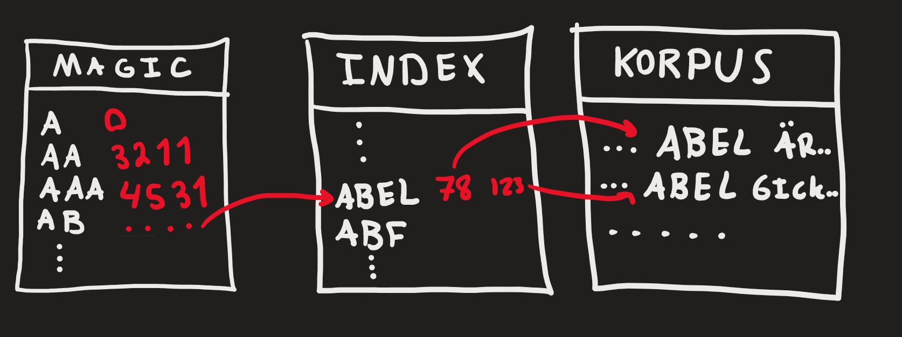

# Azeez Daoud Task 18

NOTE! The techniques used are heavily inspired by ADK Lecture 3 on "Latmanhashning" and the tokenizer style provided.
NOTE! All files prefixed with an underscore `_` were provided by the assignment thus I have no written them.
NOTE! There might be some sneaky bugs. Mostly due to encoding.

## Requirements
- The Zig Language Compiler. [Here](https://ziglang.org/)
- GNU Compiler Collection (Just any C compiler)
- A computer
- Svenska or any godtycklig translator

## Running
Run the `construct.bat` (or `construct.sh` if you use that). Wait for the construction.

Now you can use the concordance using the `concordance <word>` (Or `./concordance <word>` if you are using Linux) command.

## Technique used
Creates a file containing tokens of the big file (`korpus`) and store their byte offset from start. This is then compressed into one line with all offsets in that line, this file is called the `index`.

Thenafter the Index is scanned through gathering where three-letter-startings are and saving them in another file called `magic` along with their byte offset.

To find the occurances. The concordance reads the word's first three letters, checks the `magic` file, then jumps to the `index` finding the correct word. Then jumping the to `korpus` for each offset in the `index` file printing at max 25 occruances of the word along side 30 characters around the word.

This is an approxmiate demonstrative image of the jumping between files.

